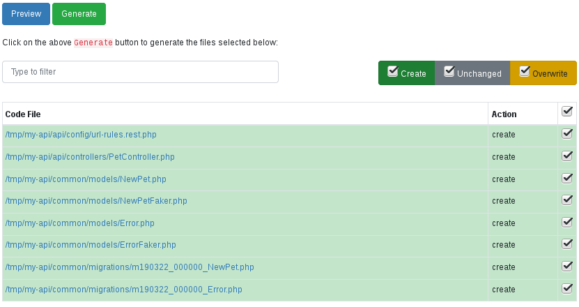

# yii2-app-api

> OpenAPI Spec to API in 3, 2, 1... done!

Yii Framework Application Template for quickly building API-first applications.

Based on [yii2-openapi](https://github.com/cebe/yii2-openapi) (code generator) and [php-openapi](https://github.com/cebe/php-openapi) (specification reader and validator).

## Demo

## Overview

This application template does not contain any useful code, it only provides the [directory structure](#structure) for your API project. 
All the code is generated from an [OpenAPI](https://www.openapis.org/about) API description file.

When working with this template you follow the [API Design-First Approach](https://apisyouwonthate.com/blog/api-design-first-vs-code-first).
So to get started building an API with this application template you need an API description first.
If you don't have one yet, you might want to check the following resources first: 

- [OpenAPI 3.0 tutorial](https://idratherbewriting.com/learnapidoc/pubapis_openapi_tutorial_overview)
- [OpenAPI Specification Version 3.0.2](http://spec.openapis.org/oas/v3.0.2) 

If you have an OpenAPI description, you can continue with the next steps:

1. [Setup](#setup)
2. [Generate Code](#generate-code)

More Docs and Guides can be found in [/docs](/docs/README.md).

## Setup 

There are two different ways:

- PHP directly on your machine
- Using Docker

### PHP directly

Having PHP and a database server installed on your machine, you can run the following commands:

    composer create-project cebe/yii2-app-api my-api
    cd my-api
    cp env.php.dist env.php
    cp config/components-ENV.local.php config/components-dev.local.php

You need to adjust `config/components-dev.local.php` to configure your database connection.

After that, run `make start` and `make stop` to control the PHP webservers for API and backend.

You may use `XDEBUGW=1` to enable xdebug for the webserver, e.g. `make XDEBUGW=1 start`.

You can now continue with [generating code](#generate-code).

### Using Docker

You need [Docker](https://docs.docker.com/install/) and [Docker Compose](https://docs.docker.com/compose/install/) installed.

Create the repository:

    composer create-project cebe/yii2-app-api my-api

For the easiest way you need GNU make, then run:

    make start-docker
    
This uses `docker-compose` to start docker containers for the API and the backend including a database.

You can now continue with [generating code](#generate-code).

> Note: If you don't have GNU make, you need to copy the configuration files as in the PHP directly section, then run:
> 
>     cp docker-compose.override.dist.yml docker-compose.override.yml
>     docker-compose up -d
>     docker-compose exec backend-php sh -c 'cd /app && composer install'

## Generate Code 

At this point you can start generating your API code to play with it by following the instructions below.
If you'd like to start a real project instead of just playing around you can find more detailed
documentation in [docs/README.md](docs/README.md) specifically the ["Getting Started"-Section](docs/getting-started.md).

### Console

> Tip: If you use Docker, run `make cli` before running any of these commands.

Run `./yii gii/api` to generate your API code. The `--openApiPath` parameter specifies the path to your OpenAPI
spec file. The following example will generate API code for the [OpenAPI petstore example](https://github.com/OAI/OpenAPI-Specification/blob/3.0.2/examples/v3.0/petstore-expanded.yaml).

    ./yii gii/api --openApiPath=https://raw.githubusercontent.com/OAI/OpenAPI-Specification/3.0.2/examples/v3.0/petstore-expanded.yaml

> Note: If the OpenAPI spec file is present locally on the file system, then `openApiPath` must be specified as an absolute path, relative paths will not work correctly.
> On UNIX based OS it must start with `/`. Example: `/home/user/documents/MyProjectOpenAPISpec.yml`

Run `./yii gii/api --help` for a list of configuration options. You may also adjust the configuration in `config/gii-generators.php`.

Then set up the database:

    ./yii migrate/up
    ./yii faker

### Web

To use the web generator, open <http://localhost:8338/gii> and select the `REST API Generator`.

Enter the path or URL to the "OpenAPI 3 Spec file", e.g. `https://raw.githubusercontent.com/OAI/OpenAPI-Specification/3.0.2/examples/v3.0/petstore-expanded.yaml`.

Click "Preview":

Click "Generate" to generate API files.

Then set up the database by running the following commands on the command line:

    ./yii migrate/up
    ./yii faker

## Try it

    cd api
    make start

Your API is now available at `http://localhost:8337/`. Try to access an endpoint of your spec via `curl`:

    $ curl http://localhost:8337/pets
    [
        {
            "name": "Eos rerum modi et quaerat voluptatibus.",
            "tag": "Totam in commodi in est nisi nihil aut et."
        },
        {
            "name": "Voluptas quia eos nisi deleniti itaque aspernatur aspernatur.",
            "tag": "Temporibus id culpa dolorem sequi aut."
        },
        {
            "name": "Facere aut similique laboriosam omnis perferendis et.",
            "tag": "Quo harum quo et ea distinctio non quam."
        },
        ...
    ]

## Application structure 

This application template consists of 3 application tiers:

- `api`, contains the Yii application for the REST API.
- `console`, contains the Yii application for console commands, cronjobs or queues (`yii` command).
- `backend`, contains the Yii application for a CRUD backend on the API data.

The following list explains the directory structure in more detail:

- `api/` - API application tier
  - `config/` - configuration for API tier
    - `url-rules.php` - custom URL rules
    - `url-rules.rest.php` - URL rules **generated** from OpenAPI Description
    - `components.php` - application components
    - `app.php` - Yii application config (+ overrides for different environments `app-*.php`)
  - `controllers/` - Controller classes **generated** from OpenAPI Description
  - `web/` - public web directory for API application

- `backend/` - Backend application tier
  - `config/` - configuration for Backend tier
    - `components.php` - application components
    - `app.php` - Yii application config (+ overrides for different environments `app-*.php`)
  - `controllers/` - Controller classes
  - `views/` - View files
  - `web/` - public web directory for Backend application

- `common/` - common code files
  - `models/` - model classes **generated** from OpenAPI Description
  - `migrations/` - database migrations **generated** from OpenAPI Description

- `config/` - Common configuration for all application tiers
  - `components.php` - Yii application components (+ overrides for different environments `components-*.php`)
  - `env.php` - Environment setup (YII_DEBUG, YII_ENV, path aliases, composer autoloader)
  - `events.php` - Class wide event listeners
  - `gii-generators.php` - configuration for the Gii code generator (allows to set default values for the ApiGenerator)
  - `params.php` - Configuration for `Yii::$app->params`

- `console/` - Console application tier
  - `config/` - configuration for Console tier
    - `components.php` - application components
    - `app.php` - Yii application config (+ overrides for different environments `app-*.php`)

- `logs/` - log files
- `runtime/` - temporary runtime files

# Support

**Need help with your API project?**

Professional support, consulting as well as software development services are available:

https://www.cebe.cc/en/contact

Development of this library is sponsored by [cebe.:cloud: "Your Professional Deployment Platform"](https://cebe.cloud).

