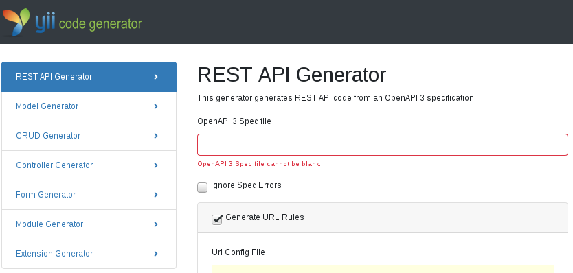

# yii2-app-api

> OpenAPI Spec to API in 3, 2, 1... done!

Yii Framework Application Template for quickly building API-first applications.

Based on [yii2-openapi](https://github.com/cebe/yii2-openapi) (code generator) and [php-openapi](https://github.com/cebe/php-openapi) (specification reader and validator).

## Overview

This application template consists of 3 application tiers:

- `api`, contains the Yii application for the REST API.
- `console`, contains the Yii application for console commands, cronjobs or queues.
- `backend`, contains the Yii application for a CRUD backend on the API data.

## Setup

    composer create-project cebe/yii2-app-api my-api
    cd my-api
    cp env.php.dist env.php

## Generate Code

### Console

Run `./yii gii/api` to generate your API code. The `--openApiPath` parameter specifies the path to your OpenAPI
spec file. The following example will generate API code for the [OpenAPI petstore example](https://github.com/OAI/OpenAPI-Specification/blob/3.0.2/examples/v3.0/petstore-expanded.yaml).

    ./yii gii/api --openApiPath=https://raw.githubusercontent.com/OAI/OpenAPI-Specification/3.0.2/examples/v3.0/petstore-expanded.yaml

Run `./yii gii/api --help` for a list of configuration options. You may also adjust the configuration in `config/gii-generators.php`.

Then set up the database:

    ./yii migrate/up
    ./yii faker

### Web

To use the web generator, start the backend server:

    cd backend
    make start

open `http://localhost:8338/gii` and select the `REST API Generator`.

Enter the path or URL to the "OpenAPI 3 Spec file", e.g. `https://raw.githubusercontent.com/OAI/OpenAPI-Specification/3.0.2/examples/v3.0/petstore-expanded.yaml`.

Click "Preview":

Click "Generate" to generate API files.

Then set up the database by running the following commands on the command line:

    ./yii migrate/up
    ./yii faker

## Try it

    cd api
    make start

Your API is now available at `http://localhost:8337/`. Try to access an endpoint of your spec via `curl`:

    $ curl http://localhost:8337/pets
    [
        {
            "name": "Eos rerum modi et quaerat voluptatibus.",
            "tag": "Totam in commodi in est nisi nihil aut et."
        },
        {
            "name": "Voluptas quia eos nisi deleniti itaque aspernatur aspernatur.",
            "tag": "Temporibus id culpa dolorem sequi aut."
        },
        {
            "name": "Facere aut similique laboriosam omnis perferendis et.",
            "tag": "Quo harum quo et ea distinctio non quam."
        },
        ...
    ]

# Support

Professional support, consulting as well as software development services are available:

https://www.cebe.cc/en/contact

Development of this library is sponsored by [cebe.:cloud: "Your Professional Deployment Platform"](https://cebe.cloud).
